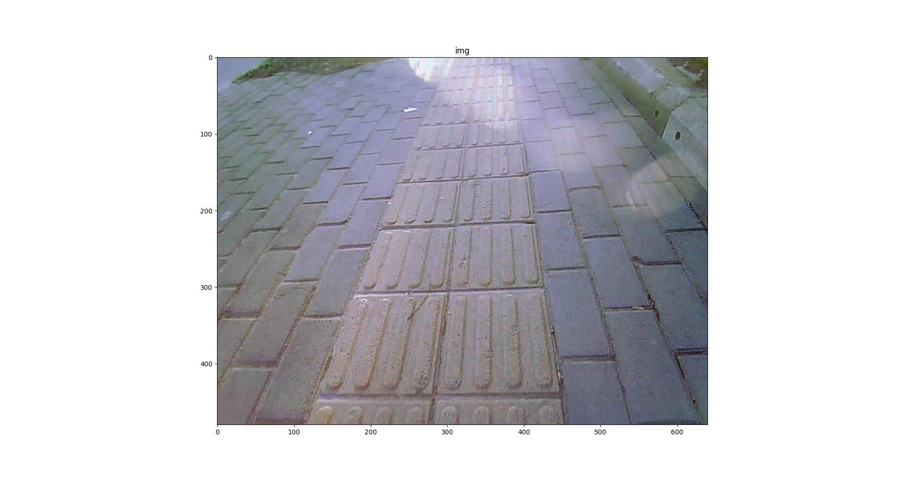

# **IPM-python**

Transform Image to BEV space by opencv-python.

## **Config**

### You can modify the config params in [`IPM_config.py`](IPM_config.py). 

## **Usage**

## Generate celibration matrix

### 1. Get Celibration corners for Stand Square.

```bash
python get_location.py
```

<div  align="center">
  
</div>

### 2. Generate and save the celibration transform matrix.

```bash
python generate_calibration_matrix.py
```

<div  align="center">
  
</div>

## Deploy IPM

### 1. Use the local transform matrix to celibrate any images captured by the same camera. Transform for another image: 

```bash
python IPM.py -i "images\out_blindroad1.jpg"
```

<div  align="center">
  
</div>


### 2. Transform for video:
```bash
python IPM.py -v "images\demo_video1.mp4"
```

<div  align="center">
  
</div>
